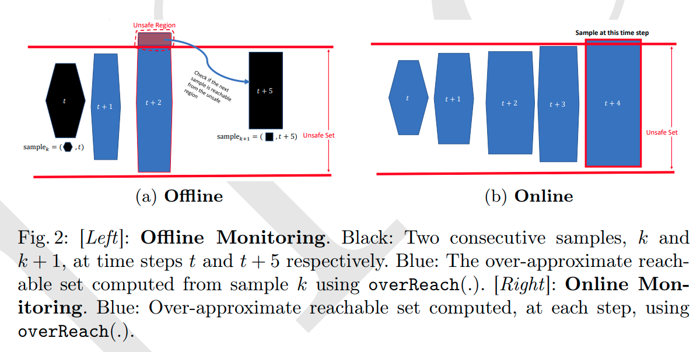
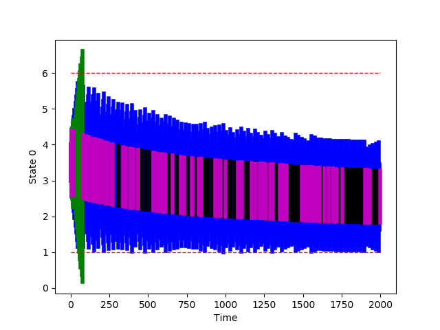

# `MoULDyS`: A Monitoring Tool for Autonomous Systems 

## What is Monitoring?

Monitoring the correctness of distributed cyber-physical systems is essential. We address the analysis of the log of a black-box cyber-physical system. Detecting possible safety violations can be hard when some samples are uncertain or missing. In this work, the log is made of values known with some uncertainty; in addition, we make use of an over-approximated yet expressive model, given by a non-linear extension of dynamical systems. Given an offline log, our approach is able to monitor the log against safety specifications with a limited number of false alarms. As a second contribution, we show that our approach can be used online to minimize the number of sample triggers, with the aim at energetic efficiency. 



The tool `MoULDyS` is based on the following paper:

> [Offline and Online Monitoring of Scattered Uncertain Logs Using Uncertain Linear Dynamical Systems.](https://arxiv.org/pdf/2204.11505.pdf)
> Bineet Ghosh, Étienne André. 
> In: Formal Techniques for Distributed Objects, Components, and Systems (FORTE). 2022.  

## `MoULDyS`: Introduction


* **`MoULDyS`:** A tool to perform monitoring of autonomous systems.
* Checkout the `MoULDyS` webpage [here](https://sites.google.com/view/mouldys).
* Given a bounding model of the system, `MoULDyS` can perform _online_ and _offline_ monitoring:
  * **Offline Monitoring**: `MoULDyS` can analyze a given log to detect possible safety violations, that might have caused the failure.
    * What kind of _logs_ can `MoULDyS` handle?
      * A log comprises of recorded samples, which can have samples missing at various time steps, and also the recorded samples can have added noise to it due to sensor uncertainties.
  * **Online Monitoring**: `MoULDyS` has a framework to infer safety of a system that triggers the logging system to sample only when needed. This targets at energy efficiency by sampling only when required.
* Interested in knowing more?
  * Please feel free to checkout the [website](https://sites.google.com/view/mouldys).

## Installation

A detailed installation guide is provided in [`/documentation/installation_guide.md`](https://github.com/bineet-coderep/MoULDyS/blob/main/documentation/installation_guide.md).

`MoULDyS` can be used in the following two ways:

1. **Virtual Machine Image (Recommend)**. This is the simplest way to use `MoULDyS`, which does not necessitate the installation of any dependencies or code downloading. Nevertheless, it is required to acquire and install the [Gurobi](https://www.gurobi.com/solutions/gurobi-optimizer/?campaignid=193283256&adgroupid=138872523040&creative=596136082776&keyword=gurobi&matchtype=e&gclid=CjwKCAjw6IiiBhAOEiwALNqncXIGRe-OYdzuBIwq3Waarc4fe6rP6DRYPh1xTWfA86OQSH_oX5zbdRoC7IUQAvD_BwE) license. Users can recreate the results easily using this method. This also requires [VirtualBox](https://www.virtualbox.org/) installed on the user's machine. The `MoULDyS` virtual machine (VM) image can be downloaded from [here](https://drive.google.com/drive/folders/1hARp49PkvRXrHY2fU63NsQ-x0A4yZqVm?usp=share_link).
2. **Install `MoULDyS` on Local Machine**. This option requires installation of the tool from scratch. 

### Virtual Machine Image (Recommend)

This is the simplest way to use `MoULDyS`, which does not necessitate the installation of any dependencies or code downloading. Nevertheless, it is required to acquire and install the [Gurobi](https://www.gurobi.com/solutions/gurobi-optimizer/?campaignid=193283256&adgroupid=138872523040&creative=596136082776&keyword=gurobi&matchtype=e&gclid=CjwKCAjw6IiiBhAOEiwALNqncXIGRe-OYdzuBIwq3Waarc4fe6rP6DRYPh1xTWfA86OQSH_oX5zbdRoC7IUQAvD_BwE) license. Users can recreate the results easily using this method. This also requires [VirtualBox](https://www.virtualbox.org/) installed on the user's machine. The `MoULDyS` virtual machine (VM) can be downloaded from [here](https://drive.google.com/drive/folders/1hARp49PkvRXrHY2fU63NsQ-x0A4yZqVm?usp=share_link).

### Install `MoULDyS` on Local Machine

#### Dependencies

- [`Python 3.9.x`](https://www.python.org/)
- [`NumPy`](https://numpy.org/)
- [`SciPy`](https://scipy.org/)
- [`mpmath`](https://mpmath.org/)
- Gurobi Python Interface:
  - Please obtain appropriate Gurobi License from [here](http://www.gurobi.com/downloads/licenses/license-center). Please refer to this [link](https://www.gurobi.com/documentation/8.1/quickstart_windows/academic_validation.html) for details. After the license is installed properly, Gurobi can be used from home network.
  - Install Gurobi. Please note that we will need Gurobi Python Interface: 
    - On-line documentation on installation can be found [here](http://www.gurobi.com/documentation/).
    - **[Recommend]** Gurobi Python Interface can also be installed through [Anaconda](https://www.anaconda.com/). Details on installing Gurobi Python Interface through `conda` can be found [here](https://www.gurobi.com/documentation/8.1/quickstart_mac/installing_the_anaconda_py.html#section:Anaconda).

#### Downloading the tool

1. Download the repository to your desired location `/my/location/`:

2. Once the repository is downloaded, please open `~/.bashrc`, and add the line `export MNTR_ROOT_DIR=/my/location/MoULDyS/`, mentioned in the following steps:

   1. ```shell
      vi ~/.baschrc
      ```

   2. Once `.bashrc` is opened, please add the location, where the tool was downloaded, to a path variable `MNTR_ROOT_DIR` (This step is crucial to run the tool):

      1. ```shell
         export MNTR_ROOT_DIR=/my/location/MoULDyS/
         ```

## Using The Tool `MoULDyS`

Once `MoULDyS` is installed following either of the two ways, the steps provided in the [`/docuementation/user_guide.md`](https://github.com/bineet-coderep/MoULDyS/blob/main/documentation/user_guide.md) should run without any error.

Following are some of the crucial functionalities offered by this prototype tool:

1. Given uncertain logs, perform offline monitoring.
2. Online monitoring.

### Case studies

We offer to case studies:

1. [Anesthesia](https://cps-vo.org/node/12111).
2. [Adaptive Cruise Control (ACC)](https://ieeexplore.ieee.org/document/7349170).

To recreate the results given in the paper, please see [`/documentation/recreate_results.md`](https://github.com/bineet-coderep/MoULDyS/blob/main/documentation/recreate_results.md). Here, we illustrate the Anesthesia case study, as the other one can be run in similar fashion.

1. ```shell
   cd src/recreate_results_from_paper/
   ```

2. ```shell
   python Anesthesia.py -compare
   ```

```shell
>> STATUS: Computing reachable sets as per monitors . . .
	>> SUBSTATUS: Log Step:  0 / 93 	Time Diff:  4
Set parameter Username
Academic license - for non-commercial use only - expires 2023-06-23
	>> SUBSTATUS: Log Step:  1 / 93 	Time Diff:  4
	>> SUBSTATUS: Log Step:  2 / 93 	Time Diff:  9
	>> SUBSTATUS: Log Step:  3 / 93 	Time Diff:  3
	>> SUBSTATUS: Log Step:  4 / 93 	Time Diff:  60
		>> SUBSTATUS: Computing refinement at at time step  56
	>> Safety: Unsafe at log step  4 
	>> Time Taken:  1.8150854110717773 
>> STATUS: Performing online monitoring using reachable sets . . .
	>> SUBSTATUS: Triggering a log at time  49 	 Time Taken (Diff):  2.8897838592529297
	>> SUBSTATUS: Triggering a log at time  84 	 Time Taken (Diff):  1.5441653728485107
	>> SUBSTATUS: Triggering a log at time  118 	 Time Taken (Diff):  1.4773943424224854
	>> SUBSTATUS: Triggering a log at time  151 	 Time Taken (Diff):  1.4035592079162598
	>> SUBSTATUS: Triggering a log at time  184 	 Time Taken (Diff):  1.3938045501708984
	>> SUBSTATUS: Triggering a log at time  216 	 Time Taken (Diff):  1.3295047283172607
	>> SUBSTATUS: Triggering a log at time  247 	 Time Taken (Diff):  1.23390531539917
	>> SUBSTATUS: Triggering a log at time  278 	 Time Taken (Diff):  1.2304279804229736
	>> SUBSTATUS: Triggering a log at time  308 	 Time Taken (Diff):  1.1959354877471924
	>> SUBSTATUS: Triggering a log at time  338 	 Time Taken (Diff):  1.1893253326416016
. 
.
.
>> SUBSTATUS: Triggering a log at time  1915 	 Time Taken (Diff):  0.504248857498169
	>> SUBSTATUS: Triggering a log at time  1934 	 Time Taken (Diff):  0.4994475841522217
	>> SUBSTATUS: Triggering a log at time  1953 	 Time Taken (Diff):  0.5091230869293213
	>> SUBSTATUS: Triggering a log at time  1972 	 Time Taken (Diff):  0.5124149322509766
	>> SUBSTATUS: Triggering a log at time  1991 	 Time Taken (Diff):  0.5127806663513184
	>> Safety: Safe
	>> Number of Logs:  84 
	>> Time Taken:  66.15031671524048 
>> STATUS: Performed online monitoring using reachable sets!
```

One should see the following plot:



Note: Visualization takes quite some time.

The results provided in the paper can be found in [`/my/location/Monitoring/output/FORTE22`](https://github.com/bineet-coderep/MoULDyS/tree/main/output/FORTE22).
