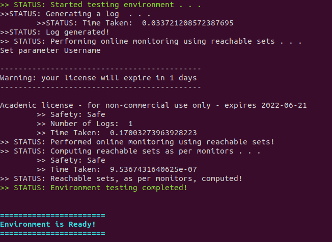

# `MoULDyS` Installation Guide

One can use `MoULDys` in the following two ways:

1. **[Recommended]** Download from source.
2. Through Docker. (ToDo)

## Download from Source

### Install Dependencies

One needs to install the following dependencies first.

- [`Python 3.9.x`](https://www.python.org/)
- [`NumPy`](https://numpy.org/)
- [`SciPy`](https://scipy.org/)
- [`mpmath`](https://mpmath.org/)
- Gurobi Python Interface:
  - Please obtain appropriate Gurobi License from [here](http://www.gurobi.com/downloads/licenses/license-center). Please refer to this [link](https://www.gurobi.com/documentation/8.1/quickstart_windows/academic_validation.html) for details. After the license is installed properly, Gurobi can be used from home network.
  - Install Gurobi. Please note that we will need Gurobi Python Interface: 
    - On-line documentation on installation can be found [here](http://www.gurobi.com/documentation/).
    - **[Recommend]** Gurobi Python Interface can also be installed through [Anaconda](https://www.anaconda.com/). Details on installing Gurobi Python Interface through `conda` can be found [here](https://www.gurobi.com/documentation/8.1/quickstart_mac/installing_the_anaconda_py.html#section:Anaconda).

### Downloading and Setting-Up `MoULDyS`

1. Download the repository to your desired location `/my/location/`:

   * ```shell
     git clone https://github.com/bineet-coderep/MoULDyS.git
     ```

2. Once the repository is downloaded, please open `~/.bashrc`, and add the line `export MNTR_ROOT_DIR=/my/location/MoULDyS/`, mentioned in the following steps:

   * ```shell
     vi ~/.baschrc
     ```

3. Once `.bashrc` is opened, please add the location, where the tool was downloaded, to a path variable `MNTR_ROOT_DIR` (This step is crucial to run the tool):

   * ```shell
     export MNTR_ROOT_DIR=/my/location/MoULDyS/
     ```

### Testing The Environment (Optional)

We have provided a testing script, [`testInstall.py`](https://github.com/bineet-coderep/MoULDyS/blob/main/env_test/testInstall.py), in the folder `/my/location/MoULDyS/env_test/` to check if the environment is ready. To perform the testing, please follow the following steps.

1. One can simply test if their environment is ready by running the following script:

   * ```shell
     python /my/location/MoULDyS/env_test/testInstall.py
     ```

2. If the following output message displays in the console (in cyan color), the environment is ready:

   * ```shell
     =======================
     Environment is Ready!
     =======================
     ```

   * Following is a screenshot displaying a ready environment: Look for "Environment is Ready!" in cyan.

     * 

3. If any other error message pops up, the environment is most likely not ready.

## Through Docker

* This is not yet available!
