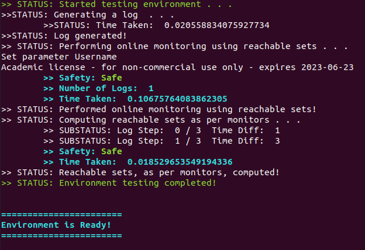

# `MoULDyS` Installation Guide

One can use `MoULDys` in the following two ways:

1. **[Recommended]** Download from source.
2. Through Docker. (Not yet available).

**The tool requires a Linux environment**. 

## Download from Source

### Install Dependencies

One needs to install the following dependencies first. The `debian` package names are provided in brackets.

- [`Python 3.9.x`](https://www.python.org/).

- [`NumPy`](https://numpy.org/)([`python-numpy`](https://packages.debian.org/search?keywords=python-numpy)).

- [`SciPy`](https://scipy.org/)([`python-scipy`](https://packages.debian.org/search?keywords=python-scipy)).

- [`mpmath`](https://mpmath.org/)([`python3-mpmath`](https://packages.debian.org/search?keywords=python3-mpmath)).

- Gurobi Python Interface:
  1. Please obtain appropriate Gurobi License from [here](http://www.gurobi.com/downloads/licenses/license-center). After the license is installed properly, Gurobi can be used from home network.
  
     1. Though one should use a license that is appropriate for them and their organization, it is worth point out that Gurobi offers free academic licenses. Here, we mention the steps to obtain a free a license. Obtain your free license by following the instructions [here](https://www.gurobi.com/academia/academic-program-and-licenses/) (please select `Individual Academic Licenses`). The license can be installed as follows (**note: must be in your university network, or in VPN**):
  
        * ```shell
          grbgetkey <your-license-key>
          ```
  
  2. Install Gurobi. Please note that we will need Gurobi Python Interface. On-line documentation on installation can be found [here](https://www.gurobi.com/documentation/9.5/quickstart_linux/cs_using_pip_to_install_gr.html). 
  
     1. **[If you are NOT a `conda` user]** One can use `pip` to install Gurobi Python interface as follows:
  
        * ```shell
          python -m pip install gurobipy
          ```
  
     2. **[If you are a `conda` user]** Gurobi Python Interface can also be installed through [Anaconda](https://www.anaconda.com/). Details on installing Gurobi Python Interface through `conda` can be found [here](https://www.gurobi.com/documentation/9.5/quickstart_mac/cs_anaconda_and_grb_conda_.html). One can use the following steps to install:
  
        1. ```shell
           conda config --add channels https://conda.anaconda.org/gurobi
           ```
  
        2. ```shell
           conda install gurobi
           ```

### Downloading and Setting-Up `MoULDyS`

1. Download the repository to your desired location `/my/location/`:

   * ```shell
     git clone https://github.com/bineet-coderep/MoULDyS.git
     ```

2. Once the repository is downloaded, please perform the following steps:

   1. Open `~/.bashrc` using your choice of editor (say, `vi`):

     * ```shell
       vi ~/.baschrc
       ```

   2. Once `.bashrc` is opened, please add the location of the tool to a path variable `MNTR_ROOT_DIR` (This step is crucial to run the tool):

     * ```shell
       export MNTR_ROOT_DIR=/my/location/MoULDyS/
       ```


### Testing The Environment (Optional)

We have provided a testing script, [`testInstall.py`](https://github.com/bineet-coderep/MoULDyS/blob/main/env_test/testInstall.py), in the folder [`/my/location/MoULDyS/env_test/`](https://github.com/bineet-coderep/MoULDyS/tree/main/env_test) to check if the environment is ready. To perform the testing, please follow the following steps.

1. One can simply test if their environment is ready by running the following script:

   * ```shell
     python /my/location/MoULDyS/env_test/testInstall.py
     ```

2. If the following output message displays in the console (in cyan color), the environment is ready:

   * ```shell
     =======================
     Environment is Ready!
     =======================
     ```

   * Following is a screenshot displaying a ready environment: Look for "Environment is Ready!" in cyan.

     * 

3. If any other error message pops up, the environment is most likely not ready.

## Through Docker

* This is not yet available!

## Development Environment Details (Optional)

Following environment has been used for development and testing `MoULDyS`.

### System Details of The Development Environment 

* OS Name: `Ubuntu 20.04.4 LTS`.
* OS Type: `64 bit`.
* GNOME Version: `3.36.8`.
* Windowing System: `X11`.

### Hardware Details of The Development Environment 

* Model: Alienware Area 51m R2.
* Processor: `Intel® Core™ i7-10700 CPU @ 2.90GHz × 16 `.
* Memory: `31.1 GiB`.
* Graphics: `NVIDIA RTX 2070 Super 8GB GDDR6 Dual `.
* Disk Capacity: `4.0 TB`.

Note: This is just the development platform, not a requirement for the tool to work.
