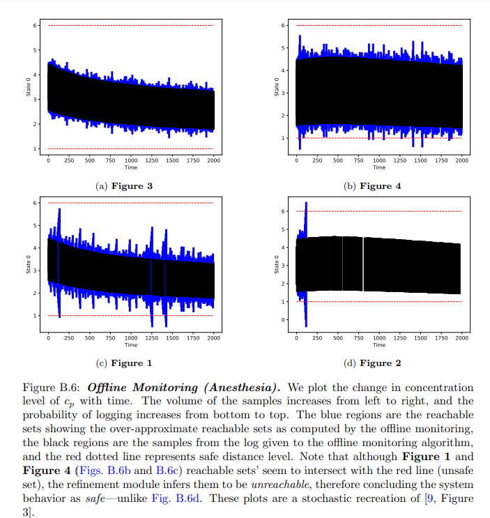
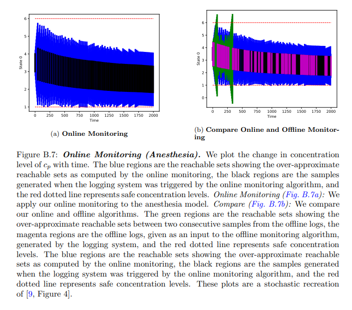
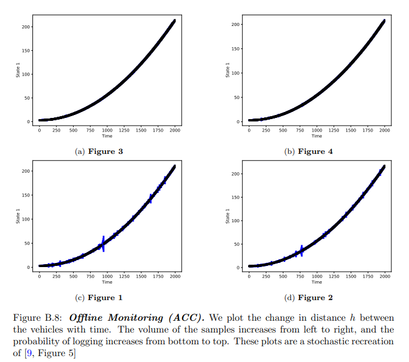
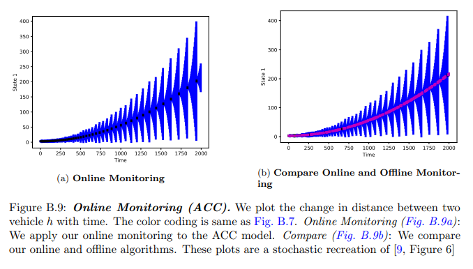

# Recreating Results From The Paper

This document provides steps to recreate the results for the two case studies, namely Anesthesia and ACC, from the following paper:

> [MoULDyS: Monitoring of Autonomous Systems in the Presence of Uncertainties]()
> Bineet Ghosh, Étienne André. 
> _Under Submission_

The details of the APIs can be found in the [`/documentation/user_manual.pdf`](https://github.com/bineet-coderep/MoULDyS/blob/main/documentation/user_guide.pdf).

## Getting Started

`MoULDyS` can be used in two ways, using the provided VM, or downloading from scratch (see [`/documentation/installation_guide.md`](https://github.com/bineet-coderep/MoULDyS/blob/main/documentation/installation_guide.md) for details).

In the rest of the document:

1. If you are using Virtual Machine (VM) to recreate the results: `my/location/` refers too `/home/admin/`
2. If you have set up `MoULDyS` from scratch, `my/location/` refers to the location where `MoULDyS` has been set-up.

## Anesthesia

### Recreating Figure B.6



Note that **Figure B.6** contains four sub-figures within it, they are numbered from Figure 1 to Figure 4 (Figures B.6a to B.6d respectively). Following are the steps to recreate these figures.

#### Step 1: Go to the corresponding folder.

```shell
cd /my/location/MoULDyS/src/recreate_results_from_paper/
```

#### Step 2: Recreate the results.

To recreate results as per figure number `f`, use `python Anesthesia.py -offline f`. For example, to recreate figure number 1:

```shell
python Anesthesia.py -offline 1
```

### Recreating Figure B.7 



* To recreate the left sub-figure:

```shell
python Anesthesia.py -online
```

* To recreate the right sub-figure:

```shell
python Anesthesia.py -compare
```

## Adaptive Cruise Control (ACC)

The steps are very similar to Anesthesia case study.

### Recreating Figure B.8



Note that **Figure B.8** contains four sub-figures within it, they are numbered from Figure 1 to Figure 4 (Figures B.6a to B.6d respectively). Following are the steps to recreate these figures.

#### Step 1: Go to the corresponding folder.

```shell
cd /my/location/MoULDyS/src/recreate_results_from_paper/
```

#### Step 2: Recreate the results.

To recreate results as per figure number `f`, use `python ACC.py -offline f`. For example, to recreate figure number 1:

```shell
python ACC.py -offline 1
```

### Recreating Figure B.9 



* To recreate the left sub-figure:

```shell
python ACC.py -online
```

* To recreate right sub-figure:

```shell
python ACC.py -compare
```

