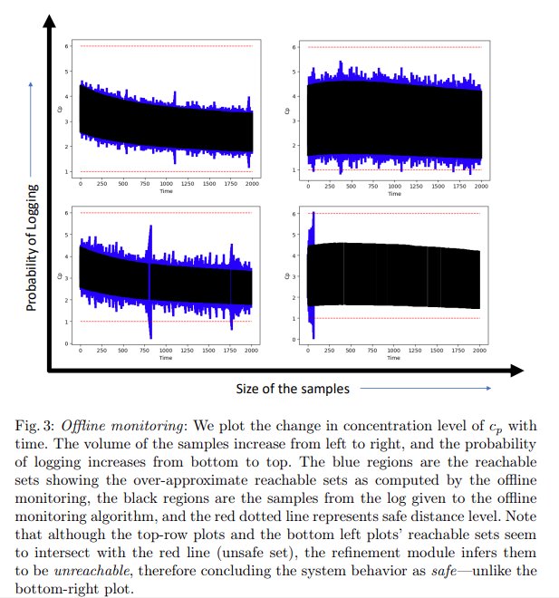
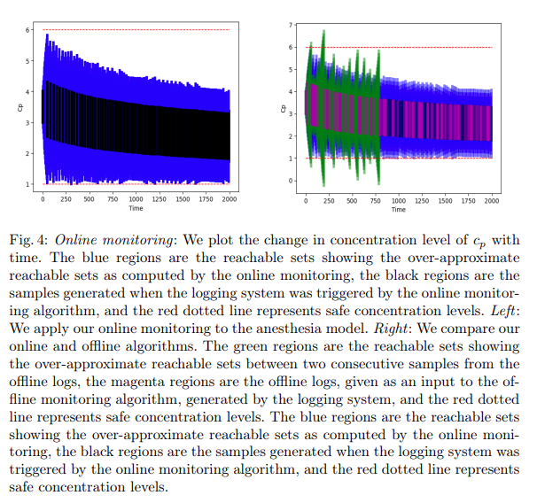
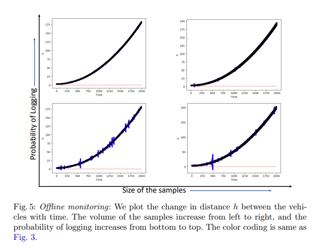
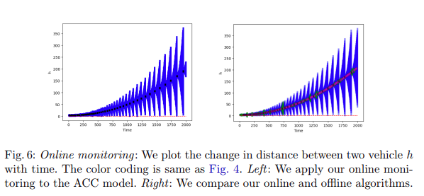

# Recreating Results From The Paper

This document provides steps to recreate the results for the two case studies, namely Anesthesia and ACC, from the following paper:

> Ghosh, B., André, É. (2022). Offline and Online Monitoring of Scattered Uncertain Logs Using Uncertain Linear Dynamical Systems. In: Formal Techniques for Distributed Objects, Components, and Systems. FORTE 2022. 

The details of the APIs can be found in the `/documentation/user_manual.pdf`.

## Anesthesia

### Recreating Figure 3



Note that Figure 3 contains four figures within it. Let the bottom-left be figure number 1, bottom-right be figure number 2, top-left be figure number 3, and top-right be figure number 4. Following are the steps to recreate these figures.

#### Step 1: Go to the corresponding folder.

```shell
cd /my/location/MoULDyS/src/recreate_results_from_paper/
```

#### Step 2: Recreate the results.

To recreate results as per figure number `f`, use `python Anesthesia.py -offline f`. For example, to recreate figure number 1:

```shell
python python Anesthesia.py -offline 1
```

### Recreating Figure 4 



* To recreate figure 4 left:

```shell
python Anesthesia.py -online
```

* To recreate figure 4 right:

```shell
python Anesthesia.py -compare
```

## Adaptive Cruise Control (ACC)

The steps are very similar to Anesthesia case study.

### Recreating Figure 5



Note that Figure 5 contains four figures within it. Let the bottom-left be figure number 1, bottom-right be figure number 2, top-left be figure number 3, and top-right be figure number 4. Following are the steps to recreate these figures.

#### Step 1: Go to the corresponding folder.

```shell
cd /my/location/MoULDyS/src/recreate_results_from_paper/
```

#### Step 2: Recreate the results.

To recreate results as per figure number `f`, use `python ACC.py -offline f`. For example, to recreate figure number 1:

```shell
python python ACC.py -offline 1
```

### Recreating Figure 6 



* To recreate figure 6 left:

```shell
python ACC.py -online
```

* To recreate figure 6 right:

```shell
python ACC.py -compare
```

## 

