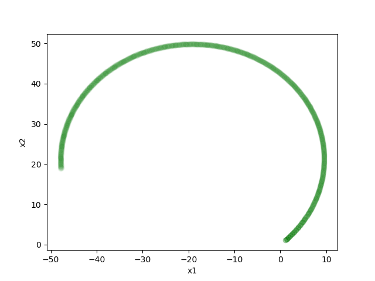
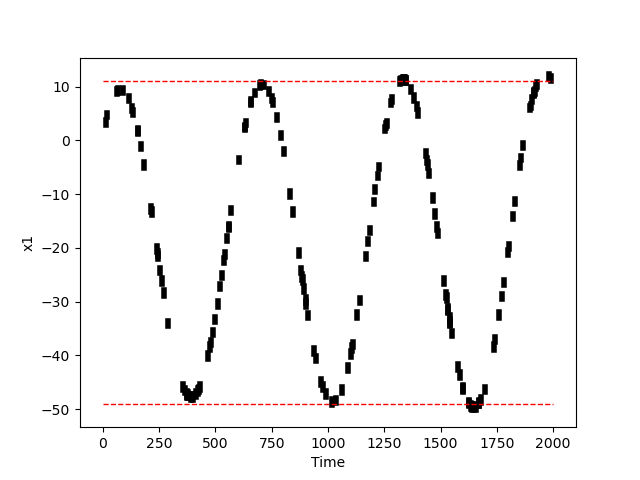
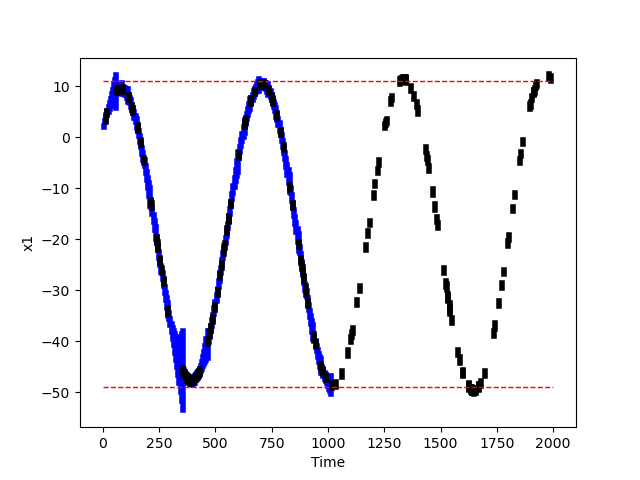
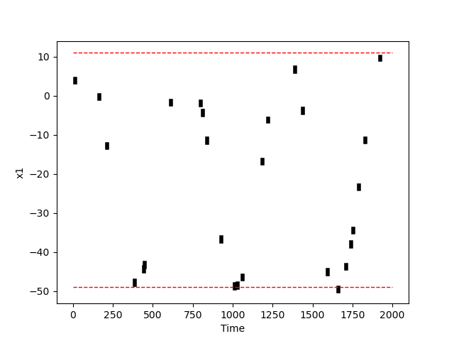
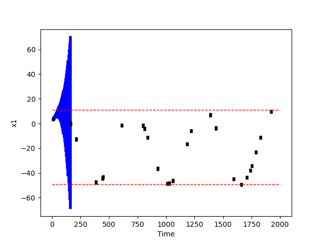
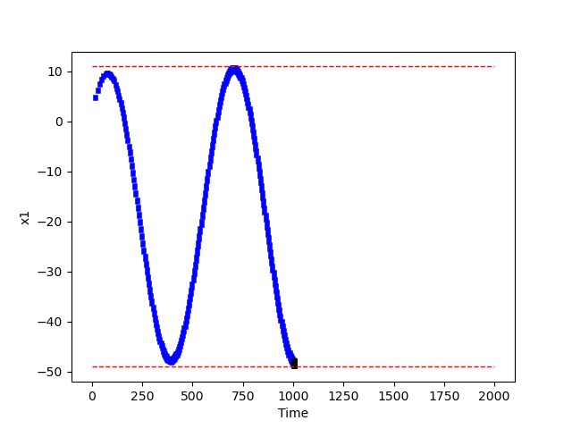

# Aircraft

## Model

* Proposed in: 
  * Platzer, André & Clarke, Edmund. (2009). Formal Verification of Curved Flight Collision Avoidance Maneuvers: A Case Study. 547-562. 10.1007/978-3-642-05089-3_35. 
* Used by:
  * R. Lal and P. Prabhakar, "Bounded error flowpipe computation of parameterized linear systems," *2015 International Conference on Embedded Software (EMSOFT)*, 2015, pp. 237-246, doi: 10.1109/EMSOFT.2015.7318279.

Following state variables:

* $x_1$: Position of the vehicle in, say, $x$ axis.
* $x_2$: Position of the vehicle in, say, $y$ axis. 
* ($d_1$,$d_2$): Velocity in the respective directions.

Parameters:

* $\omega$: Angular velocity, which is a parameter that changes depending on the mode of the airplane. In particular, some complicated computation is used to set its value during a mode change. Hence, the value is not known a priori, however, a bound on its value can be inferred.

## Behavior of the system

* Initial Set:

  * ```python
    P = [ (1.1,1.11), (1.1,1.11), (20,20.1), (20,20.1) ]
    ```

* $\omega$ = 1

* `Time Step: 400`. NOTE: Our monitoring experiments will, although, be for 2000 steps.

* NOTE: This behavior doesn't assume any perturbation on the parameter $\omega$. But our monitoring experiments will.




--------------------------------------------------------------------------------------


## Case Study

In this case study we will stress-test our monitoring algorithms. In particular, we answer the following questions:

* Case 1: Demonstrate offline monitoring case where the logs are borderline-safe to unsafe.
* Case 2: Demonstrate offline monitoring case where time-gap between two logs are significant. In other words, the logging probability is significantly small.
* Case 3: Demonstrate online monitoring where the system is robustly-safe. 

### Case 1

* Perturbation: $\omega \pm 1\%$, where $\omega=1$.

* Initial Set (Same as above):

  * ```python
    P = [ (1.1,1.11), (1.1,1.11), (20,20.1), (20,20.1) ]
    ```

* Probability of Logging: 7%



```shell
>> STATUS: Computing reachable sets as per monitors . . .
	>> SUBSTATUS: Log Step:  0 / 165 	Time Diff:  12
	>> SUBSTATUS: Log Step:  1 / 165 	Time Diff:  8
	>> SUBSTATUS: Log Step:  2 / 165 	Time Diff:  42
		>> SUBSTATUS: Computing refinement at at time step  55
		>> SUBSTATUS: Computing refinement at at time step  56
		>> SUBSTATUS: Computing refinement at at time step  57
		>> SUBSTATUS: Computing refinement at at time step  58
		>> SUBSTATUS: Computing refinement at at time step  59
		>> SUBSTATUS: Computing refinement at at time step  60
		>> SUBSTATUS: Computing refinement at at time step  61
	>> SUBSTATUS: Log Step:  3 / 165 	Time Diff:  4
	>> SUBSTATUS: Log Step:  4 / 165 	Time Diff:  23
	>> SUBSTATUS: Log Step:  5 / 165 	Time Diff:  25
	>> SUBSTATUS: Log Step:  6 / 165 	Time Diff:  16
	>> SUBSTATUS: Log Step:  7 / 165 	Time Diff:  5
	>> SUBSTATUS: Log Step:  8 / 165 	Time Diff:  19
	>> SUBSTATUS: Log Step:  9 / 165 	Time Diff:  1
	>> SUBSTATUS: Log Step:  10 / 165 	Time Diff:  13
	>> SUBSTATUS: Log Step:  11 / 165 	Time Diff:  15
	>> SUBSTATUS: Log Step:  12 / 165 	Time Diff:  31
	>> SUBSTATUS: Log Step:  13 / 165 	Time Diff:  2
	>> SUBSTATUS: Log Step:  14 / 165 	Time Diff:  24
	>> SUBSTATUS: Log Step:  15 / 165 	Time Diff:  3
	>> SUBSTATUS: Log Step:  16 / 165 	Time Diff:  2
	>> SUBSTATUS: Log Step:  17 / 165 	Time Diff:  9
	>> SUBSTATUS: Log Step:  18 / 165 	Time Diff:  7
	>> SUBSTATUS: Log Step:  19 / 165 	Time Diff:  8
	>> SUBSTATUS: Log Step:  20 / 165 	Time Diff:  22
	>> SUBSTATUS: Log Step:  21 / 165 	Time Diff:  65
		>> SUBSTATUS: Computing refinement at at time step  343
		>> SUBSTATUS: Computing refinement at at time step  344
		>> SUBSTATUS: Computing refinement at at time step  345
		>> SUBSTATUS: Computing refinement at at time step  346
		>> SUBSTATUS: Computing refinement at at time step  347
		>> SUBSTATUS: Computing refinement at at time step  348
		>> SUBSTATUS: Computing refinement at at time step  349
		>> SUBSTATUS: Computing refinement at at time step  350
		>> SUBSTATUS: Computing refinement at at time step  351
		>> SUBSTATUS: Computing refinement at at time step  352
		>> SUBSTATUS: Computing refinement at at time step  353
		>> SUBSTATUS: Computing refinement at at time step  354
		>> SUBSTATUS: Computing refinement at at time step  355
	>> SUBSTATUS: Log Step:  22 / 165 	Time Diff:  7
	>> SUBSTATUS: Log Step:  23 / 165 	Time Diff:  9
	>> SUBSTATUS: Log Step:  24 / 165 	Time Diff:  3
	>> SUBSTATUS: Log Step:  25 / 165 	Time Diff:  1
	>> SUBSTATUS: Log Step:  26 / 165 	Time Diff:  13
	>> SUBSTATUS: Log Step:  27 / 165 	Time Diff:  12
	>> SUBSTATUS: Log Step:  28 / 165 	Time Diff:  14
	>> SUBSTATUS: Log Step:  29 / 165 	Time Diff:  7
	>> SUBSTATUS: Log Step:  30 / 165 	Time Diff:  3
	>> SUBSTATUS: Log Step:  31 / 165 	Time Diff:  5
	>> SUBSTATUS: Log Step:  32 / 165 	Time Diff:  38
	>> SUBSTATUS: Log Step:  33 / 165 	Time Diff:  8
	>> SUBSTATUS: Log Step:  34 / 165 	Time Diff:  4
	>> SUBSTATUS: Log Step:  35 / 165 	Time Diff:  8
	>> SUBSTATUS: Log Step:  36 / 165 	Time Diff:  10
	>> SUBSTATUS: Log Step:  37 / 165 	Time Diff:  11
	>> SUBSTATUS: Log Step:  38 / 165 	Time Diff:  12
	>> SUBSTATUS: Log Step:  39 / 165 	Time Diff:  7
	>> SUBSTATUS: Log Step:  40 / 165 	Time Diff:  10
	>> SUBSTATUS: Log Step:  41 / 165 	Time Diff:  4
	>> SUBSTATUS: Log Step:  42 / 165 	Time Diff:  10
	>> SUBSTATUS: Log Step:  43 / 165 	Time Diff:  7
	>> SUBSTATUS: Log Step:  44 / 165 	Time Diff:  1
	>> SUBSTATUS: Log Step:  45 / 165 	Time Diff:  10
	>> SUBSTATUS: Log Step:  46 / 165 	Time Diff:  35
	>> SUBSTATUS: Log Step:  47 / 165 	Time Diff:  26
	>> SUBSTATUS: Log Step:  48 / 165 	Time Diff:  1
	>> SUBSTATUS: Log Step:  49 / 165 	Time Diff:  4
	>> SUBSTATUS: Log Step:  50 / 165 	Time Diff:  22
	>> SUBSTATUS: Log Step:  51 / 165 	Time Diff:  2
	>> SUBSTATUS: Log Step:  52 / 165 	Time Diff:  14
	>> SUBSTATUS: Log Step:  53 / 165 	Time Diff:  23
		>> SUBSTATUS: Computing refinement at at time step  692
		>> SUBSTATUS: Computing refinement at at time step  693
		>> SUBSTATUS: Computing refinement at at time step  694
		>> SUBSTATUS: Computing refinement at at time step  695
		>> SUBSTATUS: Computing refinement at at time step  696
	>> SUBSTATUS: Log Step:  54 / 165 	Time Diff:  7
	>> SUBSTATUS: Log Step:  55 / 165 	Time Diff:  12
		>> SUBSTATUS: Computing refinement at at time step  713
		>> SUBSTATUS: Computing refinement at at time step  714
		>> SUBSTATUS: Computing refinement at at time step  715
	>> SUBSTATUS: Log Step:  56 / 165 	Time Diff:  22
	>> SUBSTATUS: Log Step:  57 / 165 	Time Diff:  12
	>> SUBSTATUS: Log Step:  58 / 165 	Time Diff:  6
	>> SUBSTATUS: Log Step:  59 / 165 	Time Diff:  17
	>> SUBSTATUS: Log Step:  60 / 165 	Time Diff:  17
	>> SUBSTATUS: Log Step:  61 / 165 	Time Diff:  13
	>> SUBSTATUS: Log Step:  62 / 165 	Time Diff:  30
	>> SUBSTATUS: Log Step:  63 / 165 	Time Diff:  12
	>> SUBSTATUS: Log Step:  64 / 165 	Time Diff:  26
	>> SUBSTATUS: Log Step:  65 / 165 	Time Diff:  11
	>> SUBSTATUS: Log Step:  66 / 165 	Time Diff:  4
	>> SUBSTATUS: Log Step:  67 / 165 	Time Diff:  2
	>> SUBSTATUS: Log Step:  68 / 165 	Time Diff:  6
	>> SUBSTATUS: Log Step:  69 / 165 	Time Diff:  7
	>> SUBSTATUS: Log Step:  70 / 165 	Time Diff:  3
	>> SUBSTATUS: Log Step:  71 / 165 	Time Diff:  8
	>> SUBSTATUS: Log Step:  72 / 165 	Time Diff:  27
	>> SUBSTATUS: Log Step:  73 / 165 	Time Diff:  7
	>> SUBSTATUS: Log Step:  74 / 165 	Time Diff:  25
	>> SUBSTATUS: Log Step:  75 / 165 	Time Diff:  7
	>> SUBSTATUS: Log Step:  76 / 165 	Time Diff:  11
	>> SUBSTATUS: Log Step:  77 / 165 	Time Diff:  30
		>> SUBSTATUS: Computing refinement at at time step  1003
	>>Safety: Unsafe at log step  77
	>>Time Taken:  27.035825967788696
```



### Case 2

* Perturbation: $\omega \pm 1\%$, where $\omega=1$.

* Initial Set (Same as above):

  * ```python
    P = [ (1.1,1.11), (1.1,1.11), (20,20.1), (20,20.1) ]
    ```

* Probability of Logging: 1%



```shell
>> STATUS: Computing reachable sets as per monitors . . .
	>> SUBSTATUS: Log Step:  0 / 27 	Time Diff:  15
	>> SUBSTATUS: Log Step:  1 / 27 	Time Diff:  149
		>> SUBSTATUS: Computing refinement at at time step  147
		>> SUBSTATUS: Computing refinement at at time step  148
		>> SUBSTATUS: Computing refinement at at time step  149
		>> SUBSTATUS: Computing refinement at at time step  150
		>> SUBSTATUS: Computing refinement at at time step  151
		>> SUBSTATUS: Computing refinement at at time step  152
		>> SUBSTATUS: Computing refinement at at time step  153
		>> SUBSTATUS: Computing refinement at at time step  154
		>> SUBSTATUS: Computing refinement at at time step  155
		>> SUBSTATUS: Computing refinement at at time step  156
		>> SUBSTATUS: Computing refinement at at time step  157
		>> SUBSTATUS: Computing refinement at at time step  158
		>> SUBSTATUS: Computing refinement at at time step  159
		>> SUBSTATUS: Computing refinement at at time step  160
		>> SUBSTATUS: Computing refinement at at time step  161
		>> SUBSTATUS: Computing refinement at at time step  162
		>> SUBSTATUS: Computing refinement at at time step  163
		>> SUBSTATUS: Computing refinement at at time step  52
	>>Safety: Unsafe at log step  1
	>>Time Taken:  19.403221607208252
```

* NOTE: It becomes unsafe at a log for which the time-difference is 149.



### Case 3

* Perturbation: $\omega \pm 0.01\%$, where $\omega=1$.

* Initial Set (Same as above):

  * ```python
    P = [ (1.1,1.11), (1.1,1.11), (20,20.1), (20,20.1) ]
    ```

NOTE: Here, the perturbation has been reduced to a very low number. This was done to stress-test our online monitoring.

```shell
>> STATUS: Performing online monitoring using reachable sets . . .
	>> SUBSTATUS: Triggering a log at time  1006 	 Time Taken (Diff):  1033.5519876480103
	>> SUBSTATUS: Triggering a log at time  1007 	 Time Taken (Diff):  0.011338949203491211
	>> SUBSTATUS: Triggering a log at time  1008 	 Time Taken (Diff):  0.010899066925048828
	>> Safety: Truly unsafe at time  1008
	>>Time Taken:  1033.57617521286
```



