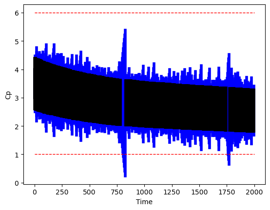
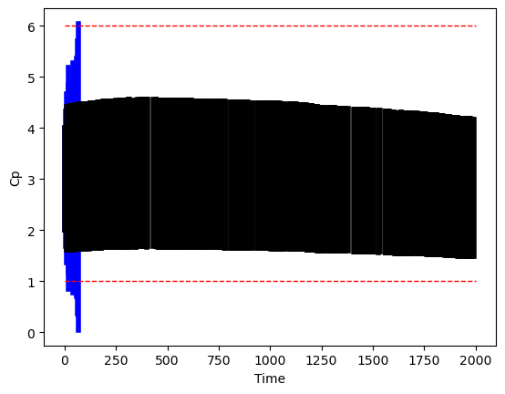
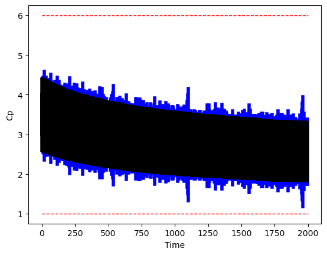
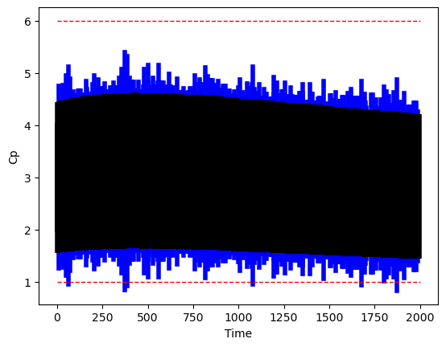
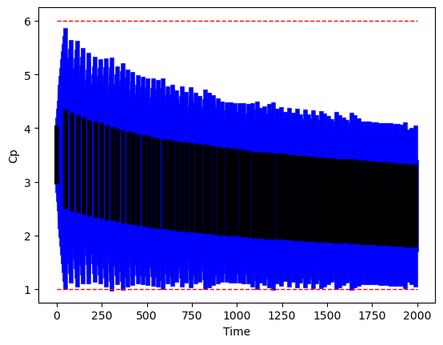
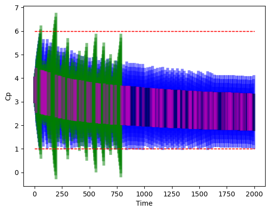

# Case Study: Anesthesia

The consolidated report will be used in the paper.

## Offline Monitoring

* 4 plots
  * X-Axis: Size of the initial set.
    * P=[(3,4),(3,4),(4,5),(3,4),(2,5)]     AND     [(2,4),(3,6),(3,6),(2,4),(2,10)]     
  * Y-Axis: Probability of logging.
    * 20%    AND     40%

### Case 1: (0,0)

* [x] Verified?

```shell
* ERORR: +/- 0.8 (Additive, time-varying)
* Logged upto time step: 2000
* Probability of Logging: 20%
* Number of Logs: 409
* Initial Set: [(3,4),(3,4),(4,5),(3,4),(2,5)]
* Safety: 1 < Cp < 6
```

```shell
>> Safety: Safe
	>> Time Taken:  51.40962219238281
```



### Case 2: (0,1)

* [x] Verified?

```shell
* ERORR: +/- 0.8 (Additive, time-varying)
* Logged upto time step: 2000
* Probability of Logging: 20%
* Number of Logs: 374
* Initial Set: [(2,4),(3,6),(3,6),(2,4),(2,10)]
* Safety: 1 < Cp < 6
```

```shell
>> SUBSTATUS: Log Step:  11 / 374 	Time Diff:  20
		>> SUBSTATUS: Computing refinement at at time step  57
	>>Safety: Unsafe at log step  11
	>>Time Taken:  1.7380166053771973
```



### Case 3: (1,0)

* [x] Verified?

```shell
* ERORR: +/- 0.8 (Additive, time-varying)
* Logged upto time step: 2000
* Probability of Logging: 40%
* Number of Logs: 841
* Initial Set: [(3,4),(3,4),(4,5),(3,4),(2,5)]
* Safety: 1 < Cp < 6
```

```shell
>> Safety: Safe
	>> Time Taken:  32.9236786365509
	>> No refinements were needed!
```



### Case 4: (1,1) 

* [x] Verified?

```shell
* ERORR: +/- 0.8 (Additive, time-varying)
* Logged upto time step: 2000
* Probability of Logging: 40%
* Number of Logs: 811
* Initial Set: [(2,4),(3,6),(3,6),(2,4),(2,10)]
* Safety: 1 < Cp < 6
```

```shell
>> Safety: Safe
	>> Time Taken:  35.9382426738739
```



## Online Monitoring

* [x] Verified?

```shell
* ERORR: +/- 0.8 (Additive, time-varying)
* Logged upto time step: 2000
* Initial Set: [(3,4),(3,4),(4,5),(3,4),(2,5)]
* Safety: 1 < Cp < 6
```

```shell
>> Safety: Safe
	>> Number of Logs:  83
	>> Time Taken:  109.04703640937805
```



## Comparing Online and Offline Monitoring

* [x] Verified?

```shell
* ERORR: +/- 0.8 (Additive, time-varying)
* Logged upto time step: 2000
* Probability of Logging for Offline Monitoring: 5%
* Initial Set: [(3,4),(3,4),(4,5),(3,4),(2,5)]
* Safety: 1 < Cp < 6
```

```shell
# Online Monitoring
	>> Safety: Safe
	>> Number of Logs:  84
	>> Time Taken:  107.99598741531372

# Offline Monitoring
	>>Safety: Unsafe at log step  35
	>> Number of Logs: 115
	>>Time Taken:  71.37526774406433
```

