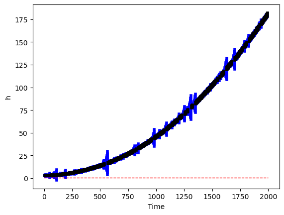
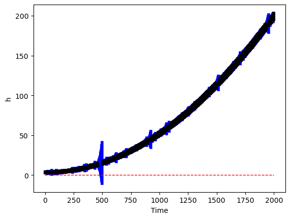
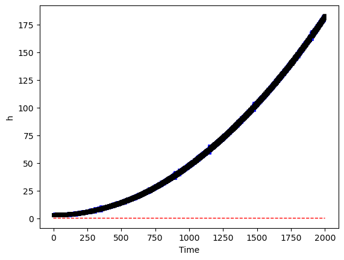
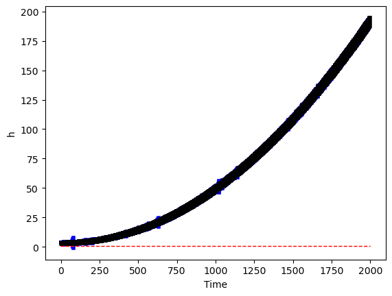
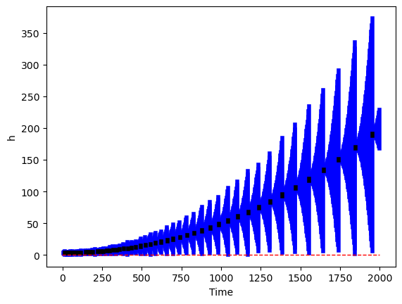
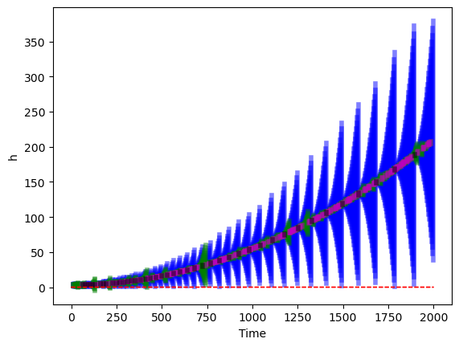

# Case Study: ACC

The consolidated report will be used in the paper.

## Model:

* State Variables:
  * Velocity of the vehicle
  * Distance between the vehicles
  * Velocity of the lead vehicle

## Parameters/Uncertainties

* Acceleration of the lead vehicle: [-0.9,0.6]
* Engine Torque / Breaking Force: [-0.6,2.46]

## Offline Monitoring

* 4 plots
  * X-Axis: Size of the initial set.
    * Initial Sets:
      * Smaller:
        * Velocity of vehicle: [15,15.01]
        * Distance between the vehicles: [3,3.03]
        * Velocity of the lead vehicle: [14.9,15]
      * Larger:
        * Velocity of vehicle: [15,15.1]
        * Distance between the vehicles: [3,3.5]
        * Velocity of the lead vehicle: [14.9,15.1]
  * Y-Axis: Probability of logging.
    * 20%    AND     40%

### Case 1: (0,0)

* [x] Verified?

```shell
* ERORR: Given Above
* Logged upto time step: 2000
* Probability of Logging: 20%
* Number of Logs: 394
* Initial Set: [(15,15.01),(3,3.03),(14.9,15)]
* Safety: h > 0.5
```

```shell
>> Safety: Safe
	>> Time Taken:  19.08415961265564
```




### Case 2: (0,1)

* [x] Verified?

```shell
* ERORR: Given Above
* Logged upto time step: 2000
* Probability of Logging: 20%
* Number of Logs: 439
* Initial Set: [(15,15.1),(3,3.5),(14.9,15.1)]
* Safety: h > 0.5
```

```shell
>> Safety: Safe
	>> Time Taken:  20.84562587738037
```




### Case 3: (1,0)

* [x] Verified?

```shell
* ERORR: Given Above
* Logged upto time step: 2000
* Probability of Logging: 40%
* Number of Logs: 774
* Initial Set: [(15,15.01),(3,3.03),(14.9,15)]
* Safety: h > 0.5
```

```shell
>> Safety: Safe
	>> Time Taken:  16.522613763809204
```



### Case 4: (1,1)

* [x] Verified?

```shell
* ERORR: Given Above
* Logged upto time step: 2000
* Probability of Logging: 40%
* Number of Logs: 786
* Initial Set: [(15,15.1),(3,3.5),(14.9,15.1)]
* Safety: h > 0.5
```

```shell
>> Safety: Safe
	>> Time Taken:  17.56607747077942
```




## Online Monitoring

* [x] Verified?

```shell
* ERORR: Given Above
* Logged upto time step: 2000
* Initial Set: [(15,15.01),(3,3.03),(14.9,15)]
* Safety: h > 0.5
```

```shell
>> Safety: Safe
	>> Number of Logs:  53
	>> Time Taken:  104.58329772949219
```




## Comparing Online and Offline Monitoring

* [x] Verified?

```shell
* ERORR: Given Above
* Logged upto time step: 2000
* Probability of Logging for Offline Monitoring: 14%
* Initial Set: [(15,15.01),(3,3.03),(14.9,15)]
* Safety: h > 0.5
```

```shell
# Online Monitoring
	>> Safety: Safe
	>> Number of Logs:  50
	>> Time Taken:  124.46551060676575

# Offline Monitoring
	>> Safety: Safe
	>> Time Taken:  28.54968547821045
	>> Number of Logs: 281
```

